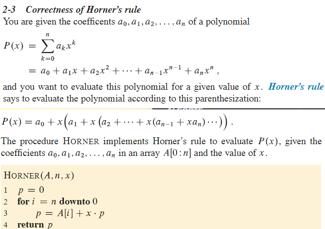

## CH2
- InsertionSortExample.java
    
    a. Insertion Sort icreasing result and decreasing result. 
    
- LinearSearchExample.java 
    
    a. (2.1-3 exercises.)
    
    b. Linear search, which scans through the sequence, looking for v. Using a loop invariant, prove that your algorithm is correct.

- MergeSortExample.java
    
    a. 2-3 compare insertion sort and merge sort. 
    
    b. Divide-and-conquer, merge1() and merge2() 
    
    c. Leads to next one InversionPairExample.java

- BubbleSortExample.java

    a. Problmem 2.2

- HornerRuleExample.java

    a. Problem 2.3

    b. 

-  InversionPairExample.java 
    
    a. Problem 2.4
    
    b. Use merge sort to be efficient 

- 